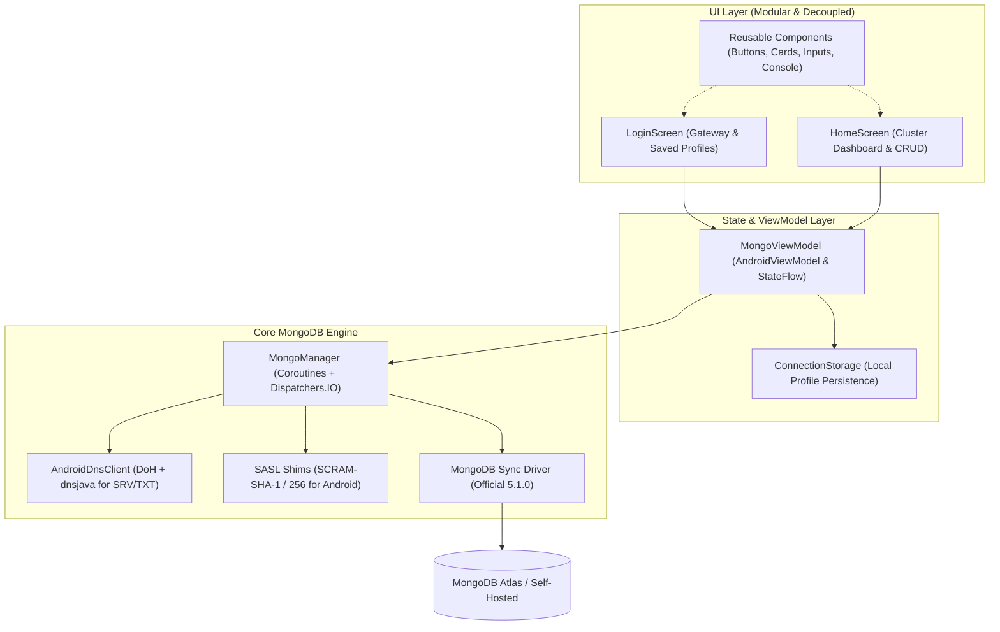

# MongoDB Kotlin Android Client — Comprehensive Phase-Wise Plan

This document outlines the architectural roadmap and development milestones for building a production-grade, enterprise-ready MongoDB client on Android.

---

## Architecture Overview

---

## Phase 1: Core Engine & Android Runtime Compatibility (Completed)
- [x] **Native DNS SRV/TXT Resolution**: Custom `AndroidDnsClient` implementing `com.mongodb.spi.dns.DnsClient` using DNS-over-HTTPS (Google & Cloudflare DoH) with `dnsjava` fallback to bypass missing `javax.naming`.
- [x] **SPI Service Provider Registration**: Wired via `META-INF/services/com.mongodb.spi.dns.DnsClientProvider`.
- [x] **Android SASL Authentication**: Native shims for `javax.security.sasl.*` (`SaslClient`, `SaslException`, `AuthenticationException`, `Sasl`) enabling SCRAM-SHA-1/256 authentication on Android ART.
- [x] **Coroutines & Connection Management**: Complete asynchronous execution on `Dispatchers.IO`.
- [x] **Automated CI/CD Pipeline**: GitHub Actions workflow (`.github/workflows/build.yml`) for automated building and APK artifact generation.

---

## Phase 2: Modular Architecture & Screen Separation (Current Phase)
- [x] **UI Component Decoupling**:
  - Independent `ui/components/` library: `SkeletonCard`, `SkeletonButton`, `SkeletonTextField`, `SkeletonBadge`, `MetricTile`, `ConsoleLogViewer`, and `SkeletonTheme`.
  - Zero coupling between UI widgets and MongoDB driver code, enabling trivial styling revamps.
- [x] **Dedicated Login Screen (`LoginScreen.kt`)**:
  - Clean connection gateway.
  - Connection profile management (save, switch, and delete clusters).
  - Quick-paste for Atlas URIs and credential visibility toggling.
  - Diagnostic error log console for instant troubleshooting.
- [x] **Dedicated Home Screen (`HomeScreen.kt`)**:
  - Live cluster topology: server version, architecture mode (ReplicaSet/Sharded), active replica hosts.
  - Live cluster ping latency monitor (`[PING: XXms]`).
  - Detailed Database Inspector (`dbStats`): Collections count, Document count, Data size, Storage size, Index count, Index size.
  - Interactive Collections Explorer with real-time document count badges.
  - Full CRUD execution panel (Find, Insert, Update, Delete) with raw JSON/BSON formatter.
- [x] **Local Profile Storage**:
  - `ConnectionStorage` utilizing persistent storage for saved clusters and last-connected metadata.

---

## Phase 3: Advanced Query & Data Manipulation Engine (Completed)
- [x] **Aggregation Pipeline Executor**:
  - Multi-stage pipeline executor supporting `$match`, `$group`, `$project`, `$sort`, `$limit`, `$unwind`, and `$lookup`.
  - BSON array/object syntax parsing and live stage latency tracking.
- [x] **Projection, Sorting, Limit & Skip Controls**:
  - `QueryOptionsCard` for specifying sort order (e.g. `{"_id": -1}`), field projections (`{"name": 1}`), limit, and skip offset.
- [x] **Collection Lifecycle Management**:
  - Inline collection creation (`createCollection`).
  - Safe collection drop with confirmation (`dropCollection`).
- [x] **Index Inspector & Manager**:
  - Real-time index listing with key definitions, index names, and unique constraint badges (`IndexManagerCard`).
  - Create single-field or compound indexes with unique constraints.
  - Drop index functionality.
- [x] **Interactive Document Cards & Data Export**:
  - Per-document actions in `DocumentResultCard`: instant JSON copy, edit prefill into update tab, and single-document delete by `_id`.
  - Batch export to clipboard (`[COPY ALL]`) formatted as a clean JSON array.

---

## Phase 4: Security, Encryption & Advanced Networking
- [x] **Encrypted Profile Storage**:
  - Secure connection string credentials using Android Keystore AES-256-GCM hardware-backed encryption (`CryptoManager`).
  - Automatic transparent encryption before saving to disk and decryption on profile selection.
- [x] **Connection Pool & Timeout Tuning**:
  - Configurable socket timeouts, max pool size, read timeouts, and server selection timeouts in `NetworkConfigCard`.
  - Toggleable TLS invalid hostname verification for self-signed development clusters.

---

## Phase 5: Real-Time Cluster Monitoring & Performance Diagnostics
- [x] **Server Metrics Dashboard**:
  - Real-time `serverStatus` polling in `ClusterMetricsCard`: active/available/total connections, resident and virtual memory, network traffic in/out, and operations breakdown (inserts, queries, updates, deletes, commands).
- [x] **Current Operations & Query Profiler**:
  - Inspect currently executing queries cluster-wide via `currentOp` in `CurrentOpsCard`.
  - Terminate hung or slow operations directly from UI via `killOp` with confirmation safeguard.

---

## Phase 6: Material 3 Expressive UI Revamp & Large Screen Optimization
- [ ] **Material 3 Expressive Theming**:
  - Swap skeleton design tokens with dynamic Material You color schemes.
  - Dark Mode, Light Mode, and True Black (OLED) modes.
- [ ] **Tablet & Foldable Optimization**:
  - Dual-pane master-detail layout: Database & Collection sidebar on the left, Query editor and document inspection on the right.
- [ ] **Visual Query Builder**:
  - No-code filter builder for crafting MongoDB queries without typing raw JSON.
